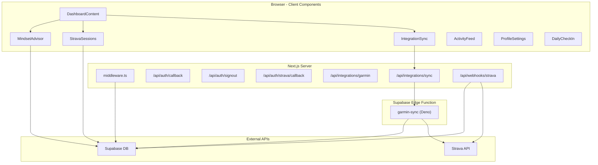

# Perf-App Codebase Hardening Plan

## Architecture Overview




---

## P0 - Critical Security Fixes

### 1. Edge Function has zero authentication

[supabase/functions/garmin-sync/index.ts](supabase/functions/garmin-sync/index.ts) accepts any caller with no auth check, uses the service role key internally, and returns user IDs + integration summaries to anyone. Also has `Access-Control-Allow-Origin: '*'`.

**Fix:**

- Validate the `Authorization: Bearer <jwt>` header using `supabase.auth.getUser(token)` and reject unauthenticated requests
- Restrict CORS to your production domain (or remove it since it's called server-to-server)
- Remove `e.stack` from error responses (line 118)
- Stop returning `user_id` in the summary to the caller

### 2. Strava webhook verify token is hardcoded

[app/api/webhooks/strava/route.ts](app/api/webhooks/strava/route.ts) line 11: `const VERIFY_TOKEN = 'performance_app_secret'` is in source code.

**Fix:** Move to `process.env.STRAVA_WEBHOOK_VERIFY_TOKEN`.

### 3. Strava OAuth callback has no CSRF `state` parameter

[app/api/auth/strava/callback/route.ts](app/api/auth/strava/callback/route.ts) does not validate an OAuth `state` param, allowing CSRF-style account-linking attacks.

**Fix:** Generate a random `state` value on the connect button, store it in a cookie, and validate it in the callback.

### 4. `/admin` and `/wellness` routes are unprotected

[middleware.ts](middleware.ts) line 64 only protects `['/dashboard', '/profile', '/integrations']`. The `/admin` and `/wellness` pages are accessible to unauthenticated users.

**Fix:** Add `/admin`, `/wellness` to `protectedRoutes`. Consider making `/admin` require a role check as well.

### 5. Reflected URL params as status messages

[app/integrations/page.tsx](app/integrations/page.tsx) lines 27-31 renders `searchParams.get('success')` and `searchParams.get('error')` directly. An attacker can craft phishing URLs with misleading messages.

**Fix:** Whitelist expected message values or use a code-to-message map instead of rendering raw query params.

---

## P1 - Deprecated Patterns and Auth Hardening

### 6. Remove deprecated `@supabase/auth-helpers-`* packages

[package.json](package.json) lines 15-16 still have `@supabase/auth-helpers-nextjs` and `@supabase/auth-helpers-react`. These are deprecated in favour of `@supabase/ssr` which is already installed and in use.

**Fix:** `npm uninstall @supabase/auth-helpers-nextjs @supabase/auth-helpers-react`

### 7. Upgrade Supabase SSR cookie pattern from legacy to `getAll`/`setAll`

[middleware.ts](middleware.ts) and [lib/supabase/server.ts](lib/supabase/server.ts) both use the old `get`/`set`/`remove` cookie API from `@supabase/ssr` v0.1-v0.4. The installed v0.9 expects `getAll` and `setAll`.

**Fix:** Rewrite both files to use the modern pattern:

```typescript
cookies: {
  getAll() { return cookieStore.getAll() },
  setAll(cookiesToSet) {
    cookiesToSet.forEach(({ name, value, options }) =>
      cookieStore.set(name, value, options))
  }
}
```

### 8. Use `getUser()` instead of `getSession()` in API routes

[app/api/integrations/garmin/route.ts](app/api/integrations/garmin/route.ts) line 10 uses `getSession()` which reads from cookies without server-side JWT validation. Supabase docs explicitly recommend `getUser()` for secure server-side auth.

**Fix:** Replace `getSession()` with `getUser()` in all server-side auth checks.

### 9. Strava webhook uses cookie-based client (no cookies in webhooks)

[app/api/webhooks/strava/route.ts](app/api/webhooks/strava/route.ts) line 30 uses `createClient()` from `lib/supabase/server` which is cookie-based. Webhooks from Strava carry no browser cookies, so this effectively operates with anon-key permissions only.

**Fix:** Use a service-role Supabase client in the webhook handler (create from env vars directly).

---

## P2 - Architecture and Code Quality

### 10. Eliminate `lib/supabase.ts` module-scope singleton

[lib/supabase.ts](lib/supabase.ts) calls `createClient()` at module evaluation time. This is a footgun if any Server Component transitively imports it. Six components currently use it.

**Fix:** Delete `lib/supabase.ts`. Update all 6 consumer files to call `createClient()` from `lib/supabase/client` inside the component body (or use a shared hook).

### 11. Standardize Supabase client creation in components

Some files import the singleton from `@/lib/supabase`, others call `createClient()` inside the component body on every render. Both patterns coexist.

**Fix:** Create a single `useSupabase()` hook that calls `createClient()` once via `useMemo` or `useRef`, and use it everywhere.

### 12. Add centralized env var validation

Every file uses `!` (non-null assertion) on `process.env.`* values. If an env var is missing, errors are cryptic.

**Fix:** Create `lib/env.ts` that validates and exports typed env vars at startup, throwing clear errors for missing values.

### 13. Replace `any` types throughout

- [DashboardContent.tsx](app/components/DashboardContent.tsx) line 102: `useState<any>(null)` in QuickStats
- [ActivityFeed.tsx](app/components/ActivityFeed.tsx) line 9: `useState<any[]>([])`
- [integrations/page.tsx](app/integrations/page.tsx) line 18: `useState<any[]>([])`
- All `catch (err: any)` blocks across API routes

**Fix:** Define proper interfaces for each data shape. Use `catch (err: unknown)` with `instanceof Error` narrowing.

### 14. Fix falsy-check logic bugs

- [StravaSessions.tsx](app/components/StravaSessions.tsx) lines 37, 42: `!distance` and `!seconds` treat `0` as missing
- [ActivityFeed.tsx](app/components/ActivityFeed.tsx) lines 82-85: `day.sleep_score && ...` hides value `0`
- [adviceEngine.ts](lib/adviceEngine.ts) lines 62-69: `||` used instead of `??` for fallback values (treats `0` as falsy)

**Fix:** Replace `!value` with `value == null` and `||` with `??` for numeric fallbacks.

### 15. Stop leaking internal error details to clients

Multiple API routes return `err.message`, `error.message`, or even `e.stack` to the client. This leaks implementation details.

**Fix:** Return generic error messages to clients. Log details server-side only.

---

## P3 - Performance and React Best Practices

### 16. Add error boundaries and Suspense to the dashboard

[app/dashboard/page.tsx](app/dashboard/page.tsx) has no error boundary or Suspense. If any child throws, the entire page crashes.

**Fix:** Wrap major sections in `<Suspense>` with skeleton fallbacks and add a React error boundary component.

### 17. Fix request waterfall in dashboard

Every child component (`QuickStats`, `StravaSessions`, `MindsetAdvisor`, `ActivityFeed`) independently fetches data in its own `useEffect`. This creates a serial render-then-fetch waterfall.

**Fix (incremental):** Depend on `user?.id` instead of `user` object reference in `useEffect` deps to avoid unnecessary re-fetches on token refresh. Longer term, consider a `DashboardDataProvider` context or server-side data fetching.

### 18. Clean up `setTimeout` and async effects

- [IntegrationSync.tsx](app/components/IntegrationSync.tsx), [ProfileSettings.tsx](app/components/ProfileSettings.tsx), [DailyCheckIn.tsx](app/components/DailyCheckIn.tsx): `setTimeout` not cleared on unmount
- All components with async `useEffect`: no abort flag to prevent state updates after unmount

**Fix:** Return cleanup functions from `useEffect` that clear timeouts and set abort flags.

---

## P4 - Infrastructure and Config

### 19. Clean up legacy `pages/` directory

[pages/_app.tsx](pages/_app.tsx) and [pages/_document.tsx](pages/_document.tsx) were created as workarounds for build errors. They create a dual-router configuration that causes the recurring `PageNotFoundError` and `pages-manifest.json` build failures.

**Fix:** Investigate if these can be removed now (the app uses App Router exclusively). If they're still needed for the build, document why.

### 20. Remove `dotenv` and `garmin-connect` from production deps

[package.json](package.json): `dotenv` is unnecessary in Next.js (it handles `.env` natively). `garmin-connect` appears unused in the Next.js app (only referenced in the Edge Function which uses Deno imports).

**Fix:** `npm uninstall dotenv garmin-connect` or move to `devDependencies` if needed for scripts only.

### 21. Remove leftover SQL files from project root

`create_strava_table.sql`, `fix-garmin-table.sql`, `set_admin.sql` are loose in the project root. They should live in `supabase/migrations/` for a clean project structure.

### 22. Add missing Next.js config hardening

[next.config.mjs](next.config.mjs) has no security headers, no image domain whitelist, and no `poweredByHeader: false`.

**Fix:** Add security headers (`X-Frame-Options`, `X-Content-Type-Options`, `Referrer-Policy`, CSP) and disable the `X-Powered-By` header.

---

## Priority Summary


| Priority | Count | Theme                                  |
| -------- | ----- | -------------------------------------- |
| P0       | 5     | Critical security vulnerabilities      |
| P1       | 4     | Deprecated patterns and auth hardening |
| P2       | 6     | Architecture, types, and code quality  |
| P3       | 3     | Performance and React best practices   |
| P4       | 4     | Infrastructure and config cleanup      |


